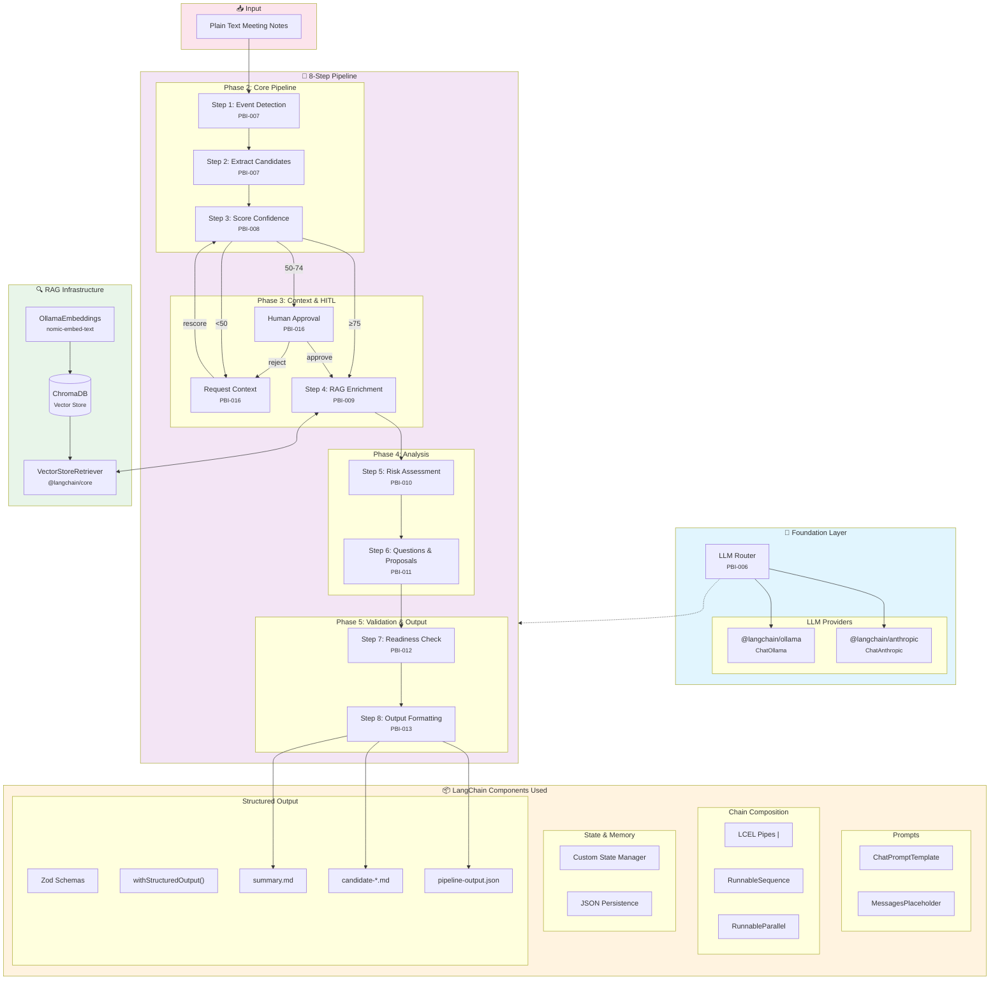
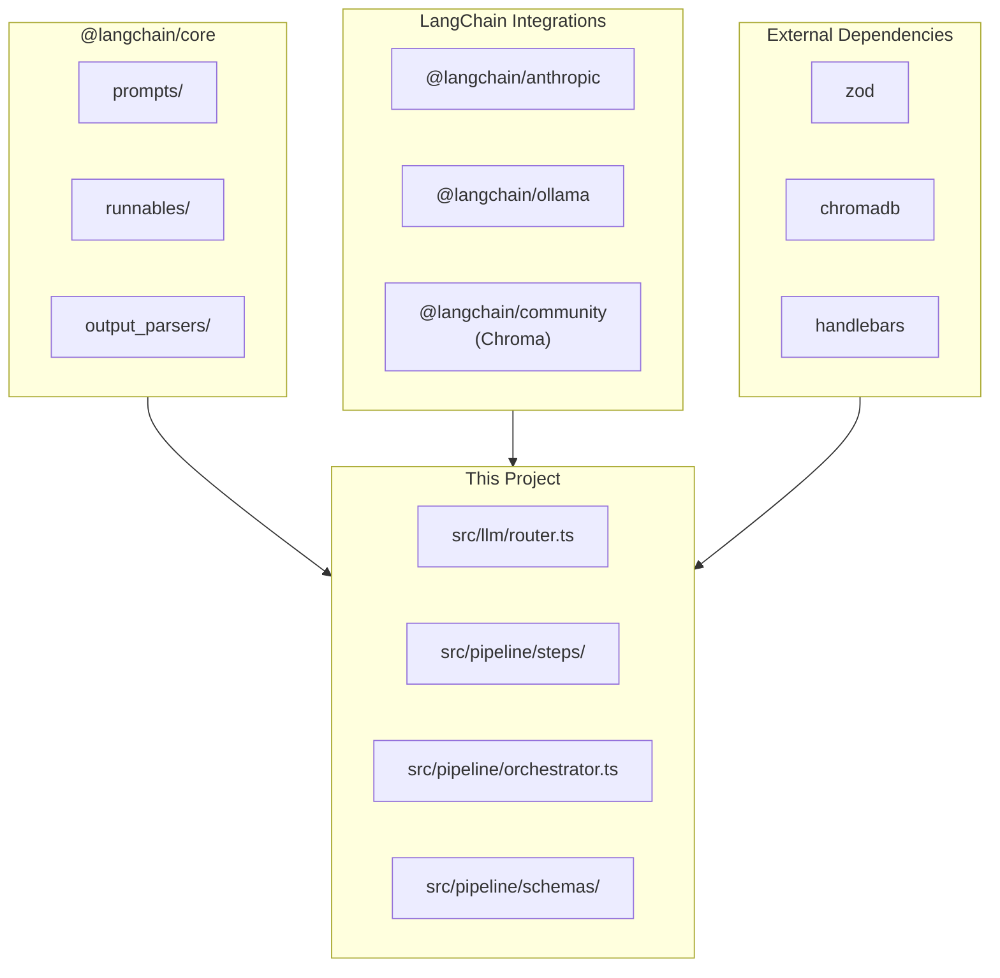
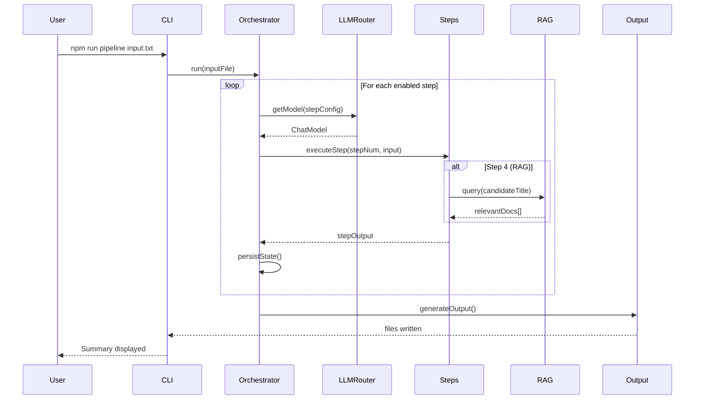

# EPIC-001: LangChain Meeting-to-PBI Pipeline

## Vision

Replicate the Backlog Chef 8-step pipeline using LangChain to:
1. Validate LangChain as a framework for AI pipelines
2. Compare implementation complexity vs custom TypeScript
3. Learn LangChain patterns for chains, agents, and RAG

## Background

The Backlog Chef project (`/Users/alwin/Projects/github.com/ApexChef/backlog-chef`) implements an 8-step pipeline that transforms meeting transcripts into structured Product Backlog Items (PBIs). This Epic aims to replicate that functionality using LangChain.

## Source Pipeline (Backlog Chef)

| Step | Name | Purpose |
|------|------|---------|
| 1 | Event Detection | Classify meeting type (refinement, planning, retro) |
| 2 | Extract Candidates | Parse transcript into raw PBI candidates |
| 3 | Score Confidence | Quality scoring (completeness, clarity, testability) |
| 4 | Enrich Context | RAG with ChromaDB for similar past work |
| 5 | Check Risks | Dependency/conflict detection |
| 6 | Generate Questions | Actionable follow-ups with proposals |
| 7 | Readiness Checker | Definition of Ready validation |
| 8 | Final Output | Multi-format export |

## Scope

### In Scope
- Plain text meeting notes as input (simplified from Fireflies JSON)
- Anthropic Claude + Ollama (local) as LLM providers
- ChromaDB as vector store (already configured)
- Structured JSON output
- All 8 pipeline steps (incremental implementation)

### Out of Scope
- Web interface
- Fireflies integration
- Jira/DevOps export
- Production deployment

## Implementation Strategy

**Phase 1: Foundation**
- LLM Router for Anthropic/Ollama switching
- Basic pipeline structure

**Phase 2: Core Pipeline (Steps 1-3)**
- Event detection chain
- Candidate extraction chain
- Confidence scoring chain

**Phase 3: Context Enrichment (Step 4)**
- Leverage existing RAG infrastructure
- Integrate with pipeline

**Phase 4: Analysis (Steps 5-6)**
- Risk assessment chain
- Question generation chain

**Phase 5: Validation & Output (Steps 7-8)**
- Readiness checking chain
- Output formatting

## Cross-Cutting Concerns

### Sibling PBI Awareness (PBI-017)

When multiple PBIs are extracted from the same source (e.g., meeting notes describing an EPIC-level feature), the pipeline must recognize relationships between them:

- **DependencyMapping Phase**: New phase after CandidateExtraction that identifies dependencies between sibling PBIs
- **Dependency Graph**: Tracks source → target relationships with type (blocks/relates-to/extends) and strength (hard/soft)
- **Downstream Impact**: Phases 4-7 are sibling-aware:
  - **ContextEnrichment**: Injects sibling context, filters overlapping external results
  - **RiskAnalysis**: Marks risks mitigated by siblings, assesses residual risk
  - **QuestionsGeneration**: Marks questions answered by siblings
  - **ReadinessChecker**: Assesses batch readiness, considers dependency chains

This prevents penalizing PBIs for "missing information" that is actually covered by sibling PBIs.

### Phase Naming Convention

Pipeline phases use descriptive names (not step numbers) to allow flexible ordering:
- EventDetection, CandidateExtraction, DependencyMapping, ConfidenceScoring, ContextEnrichment, RiskAnalysis, QuestionsGeneration, ReadinessChecker, OutputFormatting

## Success Criteria

- [ ] All 8 steps implemented as LangChain chains/agents
- [ ] Can process plain text meeting notes end-to-end
- [ ] Output matches Backlog Chef PBI structure
- [ ] LLM provider switchable via configuration
- [ ] Pipeline is resumable (state persistence)

## Child PBIs

| PBI | Title | Phase | Status |
|-----|-------|-------|--------|
| PBI-006 | LLM Router with Anthropic/Ollama | 1 | done |
| PBI-007 | EventDetection & CandidateExtraction | 2 | done |
| PBI-008 | ConfidenceScoring Chain | 2 | done |
| PBI-009 | ContextEnrichment: RAG Context Enrichment | 3 | planned |
| PBI-010 | RiskAnalysis: Risk & Conflict Assessment | 4 | planned |
| PBI-011 | QuestionsGeneration: Questions & Proposals | 4 | planned |
| PBI-012 | ReadinessChecker: Definition of Ready Validation | 5 | planned |
| PBI-013 | OutputFormatting: Multi-format Output | 5 | planned |
| PBI-014 | Pipeline Orchestrator & State Management | 5 | planned |
| PBI-015 | Refactor Pipeline to LangGraph with Shared State | 2 | done |
| PBI-016 | Human-in-the-Loop with Threshold-Based Routing | 3 | planned |
| PBI-017 | DependencyMapping: Sibling PBI Cross-Reference | 2 | planned |

**Note**: PBI-017 (Sibling Awareness) is a dependency for PBI-009, PBI-010, PBI-011, and PBI-012.

## Architecture Diagram

## LangChain Components by Step

```mermaid
flowchart LR
    subgraph Step1["Step 1: Event Detection"]
        S1_PT["ChatPromptTemplate"]
        S1_SO["withStructuredOutput"]
        S1_Zod["EventSchema (Zod)"]
    end

    subgraph Step2["Step 2: Extract Candidates"]
        S2_PT["ChatPromptTemplate"]
        S2_SO["withStructuredOutput"]
        S2_Zod["CandidateSchema (Zod)"]
    end

    subgraph Step3["Step 3: Score Confidence"]
        S3_PT["ChatPromptTemplate"]
        S3_SO["withStructuredOutput"]
        S3_Zod["ScoreSchema (Zod)"]
    end

    subgraph Step4["Step 4: RAG Enrichment"]
        S4_Ret["VectorStoreRetriever"]
        S4_Chain["RetrievalQAChain"]
        S4_Chroma["Chroma"]
        S4_Embed["OllamaEmbeddings"]
    end

    subgraph Step5["Step 5: Risk Assessment"]
        S5_PT["ChatPromptTemplate"]
        S5_SO["withStructuredOutput"]
        S5_Zod["RiskSchema (Zod)"]
    end

    subgraph Step6["Step 6: Questions"]
        S6_PT["ChatPromptTemplate"]
        S6_SO["withStructuredOutput"]
        S6_Zod["QuestionSchema (Zod)"]
    end

    subgraph Step7["Step 7: Readiness"]
        S7_PT["ChatPromptTemplate"]
        S7_SO["withStructuredOutput"]
        S7_Zod["ReadinessSchema (Zod)"]
    end

    subgraph Step8["Step 8: Output"]
        S8_JSON["JSON.stringify"]
        S8_MD["Handlebars Templates"]
    end

    Step1 --> Step2 --> Step3 --> Step4 --> Step5 --> Step6 --> Step7 --> Step8

    style Step4 fill:#e8f5e9
```

## Package Dependencies

## Data Flow

## References

- [Backlog Chef Source](file:///Users/alwin/Projects/github.com/ApexChef/backlog-chef)
- [Backlog Chef Pipeline Architecture](file:///Users/alwin/Projects/github.com/ApexChef/backlog-chef/docs/project/architecture/pipeline-orchestrator-architecture.md)
- [LangChain Docs](https://js.langchain.com/docs/)
